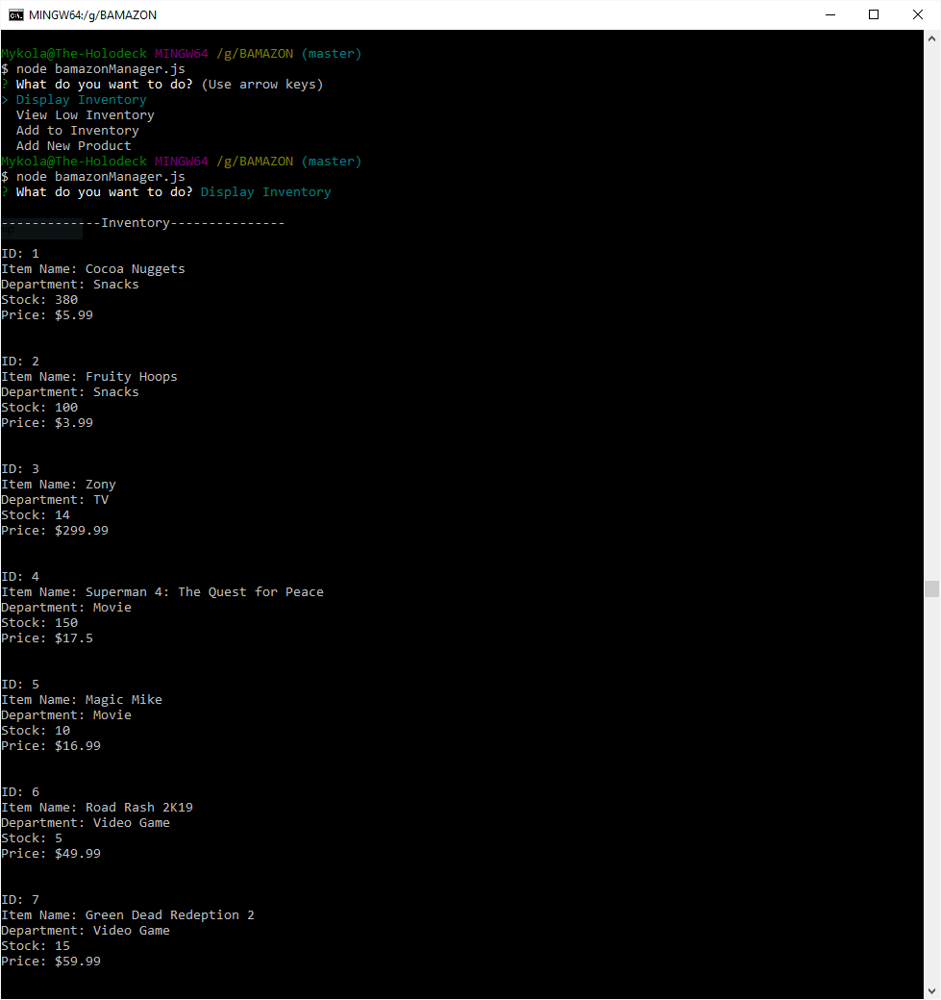
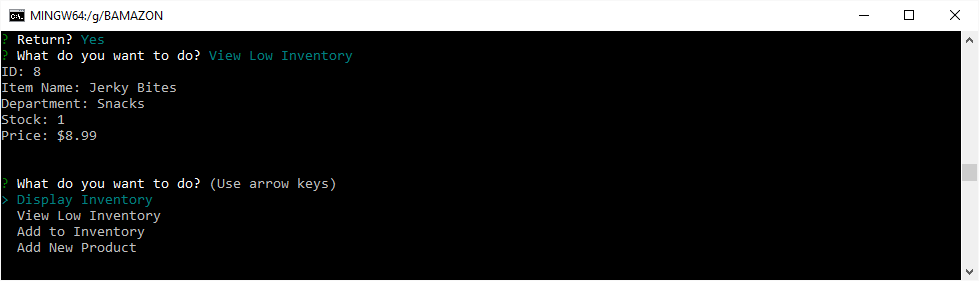
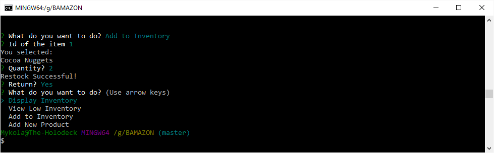
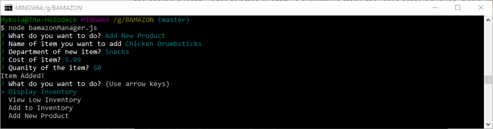

# BAMAZON
* Customer Screenshoots
  * Display Inventory
     
     
  * Buying Item
     

* Manager Screenshoots
  * Dispaly Inventory
     
  * Check Low Inventory
     
  * Add to Inventory
     
  * Add New Product
     
 
